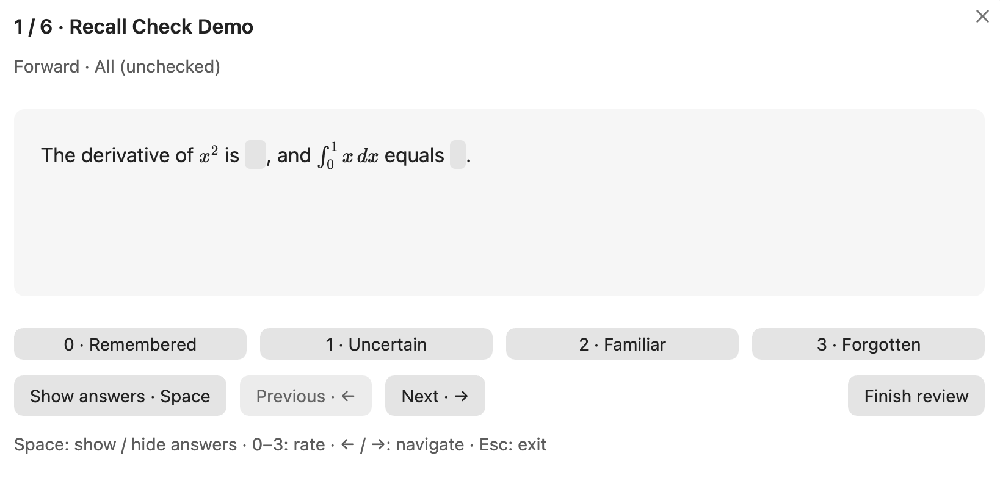
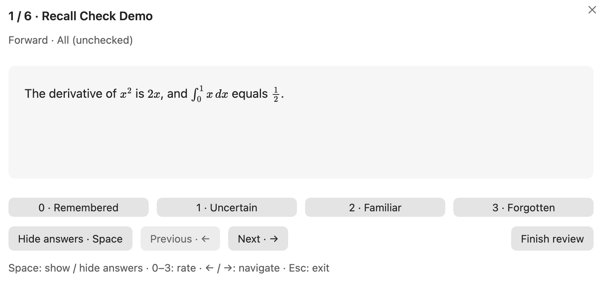
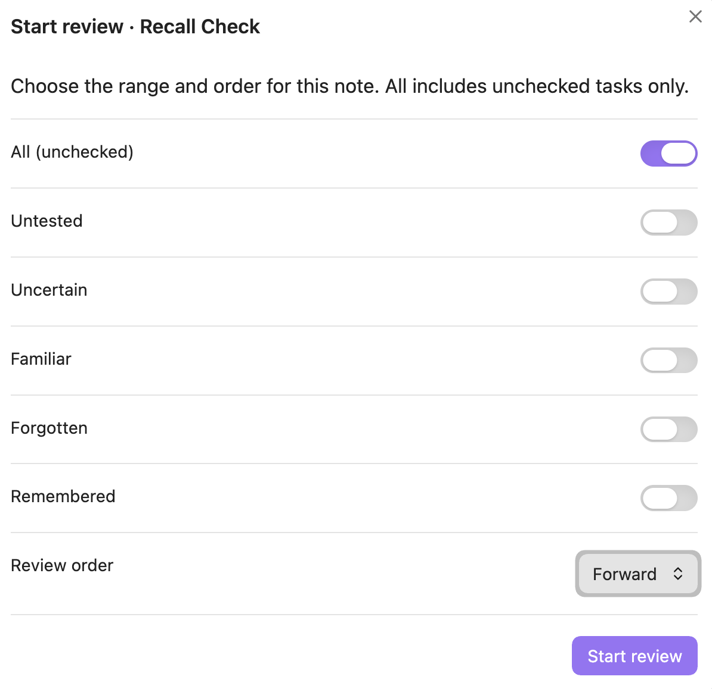
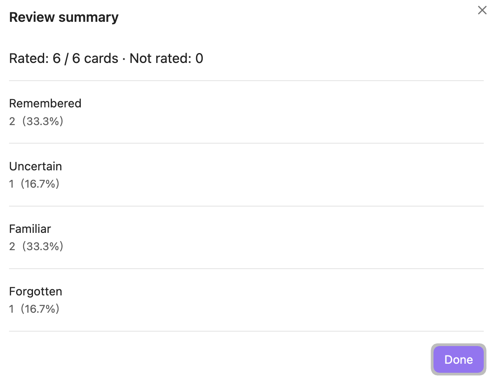

# Recall Check

**把 checkbox 笔记变成快速自测题，题目和掌握状态都留在 Markdown 中。**

Recall Check 是一个轻量的 Obsidian 插件。将题目写成 checkbox，用 `==双等号==` 标出答案，就能在当前笔记中开始复习：回忆、显示答案、评分、继续下一题。

[English](../README.md) · [展示笔记](../examples/Recall%20Check%20Demo.md) · [更新记录](../CHANGELOG.md)



## 一分钟开始

在笔记中写入题目，每题之间空一行：

```markdown
- [ ] 法国的首都是==巴黎==。

- [ ] $x^2$ 的导数是==$2x$==。

- [ ] 一道题可以有==多个答案==，
      也可以跨行，并使用 **粗体** 和 [[双链]]。
```

1. 打开笔记，点击左侧的**脑形图标**，或在命令面板运行 **Recall Check: 复习当前笔记**。
2. 选择测试范围和顺序。插件记住上次选择，打开后按 **Enter** 即可开始。
3. 按 **Space** 显示／隐藏答案，按 **0–3** 评分，或用 **←／→** 切题。

不必先显示答案才能评分。保存评分后自动进入下一题，并重新隐藏答案。

## 功能

- **按掌握程度筛选**：未测试、不确定、有印象、没记住、已记住支持组合选择；“全部”仅包含未完成题。
- **按自己的节奏复习**：顺序、逆序或随机；随机顺序在本轮开始时确定。
- **保留 Markdown 表达**：支持多处填空、多行正文、公式、粗体、斜体、行内代码、链接和双链，没有填空的问答题也能使用。
- **快捷操作**：键盘和按钮都可评分；上一题／下一题不写状态；切换答案时保留其排版空间。
- **本轮统计**：显示已评分和未评分数量，返回重新评分会替换原评分，不重复计数。
- **状态可读**：进度写在任务上方的注释中，可在编辑器里隐藏，源文件仍然保留。

界面跟随 Obsidian 的语言：中文环境显示中文，其他语言显示英文；使用 Obsidian 的主题变量适配明暗主题。

## 界面展示

截图使用英文界面；在中文 Obsidian 环境中，按钮和提示会显示中文。

### 显示答案，保持排版

同一道题按 Space 显示答案。答案的排版空间保持不变，文字和公式不会因切换而移位。



<details>
<summary>选择测试范围与顺序</summary>

“全部”只测试未完成题；具体状态可组合选择，“已记住”可用于重新测试已完成题。



</details>

<details>
<summary>查看本轮统计</summary>

统计显示已评分、未评分数量和各评分分布，同一道题重复评分不会重复计数。



</details>

## 快捷键

| 按键  | 操作                                     |
| ----- | ---------------------------------------- |
| Enter | 在范围弹窗中启动默认聚焦的“开始复习”按钮 |
| Space | 显示／隐藏当前题答案                     |
| 0     | 记住了，改为 `[x]`                       |
| 1     | 不确定，改为 `[ ]`                       |
| 2     | 有印象，改为 `[ ]`                       |
| 3     | 没记住，改为 `[ ]`                       |
| ←／→  | 上一题／下一题，不改状态                 |
| Esc   | 退出，保留已保存评分，未评分题不变       |

复习快捷键只在复习弹窗中生效，不抢占输入控件。可在 Obsidian 的快捷键设置中为“复习当前笔记”分配全局快捷键。

## 进度保存在笔记中

```markdown
<!-- RecallCheck: 不确定 -->
- [ ] 法国的首都是==巴黎==。
```

四种状态为 `记住了`、`不确定`、`有印象`、`没记住`。没有 RecallCheck 状态注释的任务视为未测试。切换界面语言不会改变已存储的中文状态值。

**“全部”不包含 `[x]` 或 `[X]`。** 选择“已记住”可重新测试这些题，即使没有状态注释也能选中。对已记住题按 1／2／3 会重新打开 checkbox。

一题从 checkbox 开始，到空行为止；相邻的 checkbox 也会分隔题目。建议每题之间空一行。Frontmatter 和围栏代码块不会生成卡片，行内代码按原样显示，不完整的填空标记作为普通文本保留。

### 测试范围的数量与占比

每类范围后显示卡片数量，以及占当前笔记全部卡片（包含已勾选任务）的比例。“全部”仍只统计未勾选任务，“已记住”统计已勾选任务；数量与实际测试筛选规则一致。

### 为答案加下划线

在 **设置 → Recall Check → 为显示的答案加下划线** 中开启。显示答案后，会在填空答案下方划线，包括公式和多行文字；不改变答案排版，默认关闭。

### 清空状态注释

在命令面板运行“清空当前笔记的状态注释”，或使用 **设置 → Recall Check** 中的同名按钮。确认笔记名称后，只删除任务上方的 RecallCheck 状态注释，保留 checkbox（包括 `[x]`）、正文、代码示例和其他插件的注释。未勾选任务清空注释后归为“未测试”，已勾选任务仍归为“已记住”。

### 隐藏／显示状态注释

插件默认在编辑器中隐藏任务上方的 RecallCheck 状态行，光标移到该行时会临时显示以便编辑。可以在 **设置 → Recall Check** 或命令面板的“切换状态注释显示／隐藏”中切换。阅读视图会按 Markdown 规则隐藏 HTML 注释。

隐藏只是显示效果，不删除源文件内容，也不影响其他注释。Easy Recall 的 `<!--SR:...-->` 会原样保留。

### 文件安全与隐私

每次评分使用 Obsidian 的 `Vault.process()` 原子读写并校验最新题目序列，区分文本相同的题目，保留无关文字的修改。复习中若题目或状态被改写、增删或重排，插件会暂停评分并提示重新开始，避免覆盖旧内容或修改错题。

不使用数据库、账号、云服务、遥测或分析。插件本身不发起网络请求、不上传笔记。评分保存在本地 Markdown，插件配置只保存范围、顺序、注释可见性和答案下划线偏好，本轮复习记录仅保存在内存中。卸载后笔记仍然可读。

## 安装

需要 **Obsidian 1.8.7 或更新版本**。主要测试平台为桌面端，移动端兼容性尚未验证。

已上架 [Obsidian 社区插件目录](https://community.obsidian.md/plugins/recall-check)。打开 **设置 → 第三方插件 → 浏览**，搜索 **Recall Check**，安装并启用即可，也可以从社区页面点击“Add to Obsidian”进入安装界面。

### 手动安装

也可从 GitHub Release 安装：

1. 从 GitHub Release 获取 `main.js`、`manifest.json`、`styles.css`，或[从源码构建](DEVELOPMENT.md)。
2. 创建 `<Vault>/.obsidian/plugins/recall-check/`，放入这三个文件。
3. 重载 Obsidian，在 **设置 → 第三方插件** 中启用 Recall Check。

## 开发与反馈

```sh
npm ci
npm run verify
```

参见[开发文档](DEVELOPMENT.md)、[测试步骤](../TESTING.md)和[发布文档](RELEASING.md)。反馈问题时请提供 Obsidian 版本、复现步骤和简短的合成示例笔记。

## 许可

[MIT](../LICENSE) · 作者 **Zhi Fu**。
